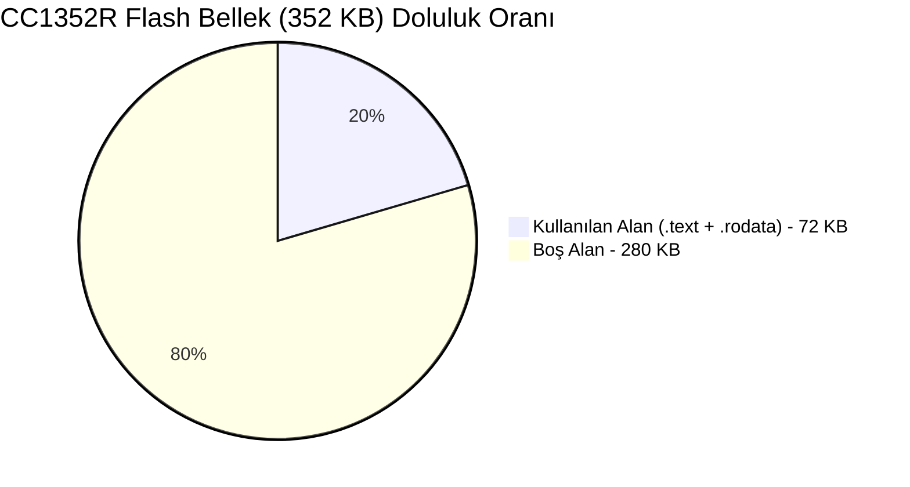
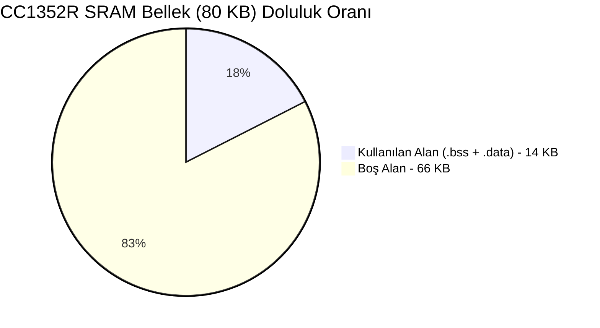
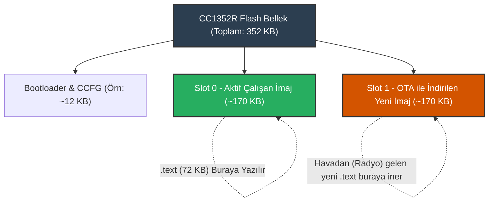

# BİL 304 — İşletim Sistemleri Dönem Projesi
## ELF ve Toolchain Analiz Raporu

**Öğrenci:** 22060338 — Şule Şahan

Bu rapor, proje yönergesinde istenen araştırma süreci kapsamında hazırlanmıştır. Analizlerde `coojaimage` klasöründe yer alan `udp-client.z1` (MSP430), `hello-world.sky` (MSP430) ve `base-demo.simplelink` (ARM CC1352R) firmware imajları kullanılmış; araç zincirlerinin (toolchain) çıktıları detaylıca yorumlanarak, imajların gömülü sistemdeki rolleri açıklanmıştır.

---

### 1. Dosyanın ELF Sınıfı, Mimarisi ve Giriş Adresi

Bu analizde imajların temel yapıtaşlarını ve hangi donanımı hedeflediklerini ortaya çıkarmak için `file` ve `msp430-readelf -h` araç zincirleri kullanılmıştır.

```bash
sule@ubuntu:~$ file udp-client.z1 base-demo.simplelink
udp-client.z1:        ELF 32-bit LSB executable, TI msp430, version 1 (embedded), statically linked, with debug_info, not stripped
base-demo.simplelink: ELF 32-bit LSB executable, ARM, EABI5 version 1 (SYSV), statically linked, with debug_info, not stripped
```

```bash
sule@ubuntu:~$ msp430-readelf -h udp-client.z1
ELF Header:
  Magic:   7f 45 4c 46 01 01 01 ff 00 00 00 00 00 00 00 00 
  Class:                             ELF32
  Data:                              2's complement, little endian
  Version:                           1 (current)
  OS/ABI:                            Standalone App
  Type:                              EXEC (Executable file)
  Machine:                           Texas Instruments msp430 microcontroller
  Entry point address:               0x3100
```

```bash
sule@ubuntu:~$ arm-none-eabi-readelf -h base-demo.simplelink | grep -E 'Machine|Entry'
  Machine:                           ARM
  Entry point address:               0x6751
```

**Kullanım Amacı ve Yorumu:**
`file` komutu, hedefin işletim sistemi veya derleyici ailesi hakkındaki en üst düzey bilgiyi verir. `readelf -h` ise ELF başlığını okuyarak doğrudan mikrodenetleyicinin mimarisini söyler.
- **Sınıf (Class) ve Endianness:** Çıktılardaki `ELF32` ve `little endian` ibareleri, her iki cihazın da 32-bit adresleme alanına sahip olduğunu ve baytları düşükten yükseğe doğru belleğe dizdiğini gösterir.
- **Mimari (Machine):** Z1 imajı `TI msp430 microcontroller` kullanırken, Simplelink imajı `ARM` mimarisindedir. Z1 cihazı sensör ağları için tasarlanmış 16-bit düşük güç tüketen bir RISC mimarisidir.
- **Giriş Adresi (Entry Point):** `udp-client.z1` için giriş adresi `0x3100` iken, `base-demo.simplelink` (ARM Cortex-M4F) imajı için bu değer `0x6751` (ResetISR rutini) olarak atanmıştır. MSP430'daki `0x3100` adresi, Flash'ın başındaki ilk kısımların bootloader veya Contiki-NG linker startup scripti tarafından başka bir amaçla ayrıldığını veya cihazın spesifik bellek haritasına uymak için linker ile bu adrese kaydırıldığını göstermektedir.
- **ABI:** `Standalone App` olması, kodun Linux/Windows gibi bir işletim sistemi arayüzüne ihtiyaç duymadan doğrudan donanım (bare-metal) üzerinde koştuğunu kanıtlar.

---

### 2. `.text`, `.data`, `.bss`, `.rodata`, `.vectors` Gibi Temel Bölümlerin Varlığı ve İfade Ettiği Anlam

Gömülü sistem imajlarının bellek haritasına (ROM/RAM) nasıl yerleşeceğini görmek amacıyla `msp430-readelf -S` komutu kullanılmıştır.

```bash
sule@ubuntu:~$ msp430-readelf -S udp-client.z1 | grep -E '\.text|\.data|\.bss|\.rodata|\.vectors'
  [ 1] .text             PROGBITS        00003100 0000b4 00a0b4 00  AX  0   0  2
  [ 2] .rodata           PROGBITS        0000d1b4 00a168 00053a 00   A  0   0  4
  [ 3] .data             PROGBITS        00001100 00a6a2 000150 00  WA  0   0  2
  [ 4] .bss              NOBITS          00001250 00a7f2 0016fe 00  WA  0   0  2
  [ 6] .vectors          PROGBITS        0000ffc0 00a7f2 000040 00  AX  0   0  1
```

**Kullanım Amacı ve Yorumu:**
`readelf -S` Section (Bölüm) başlıklarını listeler. Bu bölümler, Linker (Bağlayıcı) tarafından cihazın fiziksel belleğine göre haritalandırılmıştır.
- **`.text`:** Firmware'in işlemci tarafından yürütülecek olan asıl makine kodlarıdır. Bayraklarında yer alan `AX` (Alloc, eXecute) bunun Flash (ROM) belleğe yazılacağını ve çalıştırılacağını belirtir. Yükü en ağır olan kısımdır (0x00a0b4 = ~41 KB).
- **`.rodata` (Read-Only Data):** `printf("Hello");` gibi koda gömülü sabit metinleri (string) ve değiştirilemez matematiksel tabloları tutar. Sadece okunabilirdir, Flash bellekte tutulur.
- **`.data`:** `int node_id = 5;` gibi ilk değeri atanmış (initialize edilmiş) global/static değişkenlerdir. `WA` (Write, Alloc) bayrağı taşır. Flash'ta tutulur ancak cihaz açıldığında startup kodu tarafından RAM'e kopyalanır.
- **`.bss`:** `int buffer[100];` gibi ilk değeri olmayan (sıfır olan) global değişkenlerdir. `NOBITS` türünde olduğu görülmektedir; yani ELF dosyası içinde yer kaplamaz, ancak cihaz açıldığında RAM'de bu kadar boyutluk alanın sıfırlanarak ayrılmasını emreder.
- **`.vectors`:** Cihazın çevre birimlerinden (Timer, Radyo vs.) gelen sinyallere tepki vereceği donanımsal kesme adreslerini tutar.

---

### 3. Kod ve Veri Boyutları 

Firmware dosyalarının cihazlardaki depolama ve RAM kapasitelerini ne ölçüde doldurduğunu analiz etmek için `size` aracı kullanılmıştır.

```bash
sule@ubuntu:~$ msp430-size udp-client.z1 hello-world.sky
   text	   data	    bss	    dec	    hex	filename
  42542	    336	   5888	  48766	   be7e	udp-client.z1
  42237	    324	   6714	  49275	   c07b	hello-world.sky

sule@ubuntu:~$ arm-none-eabi-size base-demo.simplelink
   text	   data	    bss	    dec	    hex	filename
  71393	   1408	  12968	  85769	  14f09	base-demo.simplelink
```

**Kullanım Amacı ve Yorumu:**
`size` aracı, imajın cihazlarda ne kadar kalıcı bellek (Flash) ve geçici bellek (SRAM) tüketeceğini net olarak özetler.
- **Flash İhtiyacı (`text` + `data`):** Z1 cihazında kalıcı belleğe yazılacak olan yük yaklaşık 42 KB civarındayken, ARM (CC1352R) cihazında bu miktar 72 KB'a (`71393 + 1408` bayt) çıkmıştır. ARM'ın daha gelişmiş bir donanım soyutlama katmanı (RTOS/MAC) barındırdığı görülmektedir.
- **RAM İhtiyacı (`data` + `bss`):** `hello-world.sky` imajının `.bss` tüketimi 6714 bayt iken, `udp-client.z1` imajının 5888 bayttır. Bu bize, basit bir "Blink/Hello" uygulamasının bile devasa bir `.bss` harcadığını; yani cihazın altyapısında Contiki-NG ağ yığınının (Network Stack) her durumda yüklü olduğunu gösterir. Ancak `hello-world` uygulamasında spesifik bir UDP soketi açılmadığı için `udp-client` kadar iyi optimize edilememiş veya arka planda daha geniş varsayılan (default) ağ tamponları kullanılmış olabilir. ARM (CC1352R) cihazında ise `.bss` alanı 12.9 KB (12968 bayt) ile çok daha yüksektir. ARM çipinin devasa (80 KB) SRAM kapasitesi, ağ tamponları için çok daha geniş yer ayrılmasına olanak tanımıştır.

---

### 4. Sembol Tablosu ve Anlamlı Semboller 

Firmware içerisindeki fonksiyon isimlerini, adreslerini ve gizli metinleri ortaya çıkarmak için `msp430-nm` ve `msp430-strings` araçları kullanılmıştır.

```bash
sule@ubuntu:~$ msp430-nm -S -n udp-client.z1 | grep -E -i 'uip|printf' | tail -n 5
0000a5c6 0000001c T tcpip_uipcall
0000bbaa 00000030 t uip_check_mtu
0000c5f6 00000036 t call_vuprintf
0000c62c 0000001c T snprintf
0000c7be 00000742 T vuprintf
```

```bash
sule@ubuntu:~$ msp430-strings udp-client.z1 | grep "IPv6"
Tentative link-local IPv6 address: 
IPv6 addresses:
```

**Kullanım Amacı ve Yorumu:**
`nm` aracı sembol tablosunu döker. Çıktıdaki `T` bayrağı bu fonksiyonların `.text` içerisinde çalışan kodlar olduğunu ispatlar. `strings` aracı ise imajın içindeki yazılımsal mesajları yakalar.
- **Anlamlı Semboller:** `tcpip_uipcall` ve `uip_check_mtu` sembollerinin varlığı, bu firmware'in basit bir sensör olmadığını, IPv6 (uIP) protokol yığınını koşturan bir IoT ağ düğümü (UDP Client) olduğunu kanıtlar.
- **Boyut Analizi:** Tablonun boyut sütunu (ikinci sütun) incelendiğinde `vuprintf` fonksiyonunun `0x0742` (1858 bayt) gibi devasa bir alan kapladığı görülmektedir. Gömülü cihazlarda string formatlama (`printf`) işlemleri çok maliyetlidir.
- **Strings Bulguları:** İçeride IPv6 kelimelerinin hardcoded (gömülü) olarak bulunması, cihazın ağ altyapısıyla kablosuz ağ kurduğuna dair güçlü bir tersine mühendislik bulgusudur.

---

### 5. Kesme Vektörleri veya Başlangıç Adresi İle İlişkili Bilgiler 

Donanımsal kesmelerin (Interrupt) işlemci üzerindeki akışını ve Entry Point bağlantısını incelemek için `msp430-objdump -d` aracı kullanılmıştır.

```bash
sule@ubuntu:~$ msp430-objdump -d udp-client.z1 | grep -A 6 "<cc2420_timerb1_interrupt>:"
00003604 <cc2420_timerb1_interrupt>:
    3604:	0f 14       	pushm.a	#1,	r15	
    3606:	1f 42 1e 01 	mov	&0x011e,r15	
    360a:	e2 b3 1c 00 	bit.b	#2,	&0x001c	;r3 As==10
    360e:	06 24       	jz	$+14     	;abs 0x361c
    3610:	d2 53 7c 25 	inc.b	&0x257c	
```

**Kullanım Amacı ve Yorumu:**
Objdump aracı hex makine kodlarını, donanımın anladığı Assembly komutlarına çevirir. 
- **.vectors ve Entry Point İlişkisi:** Birinci bölümde Entry Point'in `0x3100` olduğunu görmüştük. Ancak MSP430 CPU'su donanım düzeyinde çalışmaya direkt `0x3100` adresinden başlamaz. Mikrodenetleyiciye ilk enerji verildiğinde CPU, Flash'ın sonlarına doğru yer alan (MSP430'da `0xFFC0 - 0xFFFF` bölgesi) **`.vectors`** (Kesme Vektör Tablosu) alanına gider. Bu tablonun en sonundaki "Reset Vector" (`0xFFFE` adresi) içinde `0x3100` değeri tutulmaktadır. Cihaz önce reset vektörünü okur, oradan Entry Point'i (`0x3100`) alır ve ancak o zaman yazılımın startup rutinine (RAM sıfırlama, C ortamı hazırlama) sıçrar.
- **Asenkron Kesme (Interrupt) İşleyişi:** Cihaz çalışma esnasında enerjiyi korumak için CPU'yu LPM (uyku) modunda bekletir. Ne zaman bir donanım sayacı (Timer) dolar veya anten (Radio) bir paket alırsa, CPU `0xFFC0` tablosundaki ilgili ISR (Interrupt Service Routine) adresine (örneğin radyo donanımı için yukarıda görülen `cc2420_timerb1_interrupt`'a) atlar. Çıktıdaki `pushm.a #1, r15` komutu, kesme geldiğinde işlemcinin o anki `r15` yazmacını yığına (Stack) yedekleyerek CPU'nun mevcut durumunu güvence altına aldığını kanıtlar. İşlem bittiğinde `reti` (Return from Interrupt) komutuyla cihaz tekrar uykusuna geri döner.

---

### 6. Dosyanın Neden "Ham Binary" Değil De "ELF Executable" Olarak Değerlendirildiği

**Yorumu:**
Geliştirilen bu imajlar (`.z1`, `.sky`) çıplak gözle bakıldığında "0" ve "1" lerden oluşan makine kodları gibi görünse de, yapısal olarak "Raw Binary" (Ham Binary) değildir. `file` aracının da ispatladığı üzere bunlar **ELF (Executable and Linkable Format)** standartlarındadır.

**Neden ELF Daha Üstündür?**
1. **Metadata Taşıması:** Ham binary dosyalar sadece kod yığınıdır; belleğin hangi adresinden çalışmaya başlayacağını bilemez. Ancak ELF dosyası bir başlık (Header) bulundurur. Bu başlık, yukarıda bahsedilen Entry Point adresini yükleyiciye bildirir.
2. **ROM/RAM Ayrımı:** Ham binary'de Text, Data, Bss ayrımı yoktur. ELF dosyasındaki Section başlıkları sayesinde araçlar, hangi bloğun ROM'a, hangi bloğun RAM'e yerleşeceğini anlar.
3. **Hata Ayıklama (Debugging):** Yukarıda kullandığımız `nm`, `strings` ve `size` komutları ham binary dosyalarda çalışamaz! Çünkü sembol isimleri (örneğin `printf`), satır numaraları (DWARF) sadece ELF formatı tarafından saklanabilir.
4. **OTA'nın Doğası:** Hazırlanan bu ELF dosyası OTA (havadan) üzerinden direkt donanıma atılamaz (içindeki devasa debug tabloları mikrokontrolörün hafızasına sığmaz). Yüklemeden hemen önce `msp430-objcopy -O binary` gibi bir araçla ELF metasından sıyrılıp "Ham Binary" (.hex / .bin) şekline dönüştürülmesi zorunludur. ELF, analiz ve derleme aşaması için şarttır.

---

### 7. SoC Disk ve Bellek Uzayı Görselleştirmeleri

Proje yönergesinde belirtilen *"X firmware, SoC'nin disk ve bellekteki hangi bölgelerinde, ne kadar yer kaplayacaktır?"* sorusuna istinaden, analiz edilen her üç firmware imajı için donanım bellek haritaları (Memory Map) gerçek çıktı boyutlarına göre aşağıda ayrı ayrı görselleştirilmiştir.

#### 7.1. MSP430 Bellek Haritası (`udp-client.z1` ve `hello-world.sky`)
MSP430 (Z1/Sky) donanımında RAM `0x1100` adresinden, Flash ise bootloader sonrası `0x3100` adresinden başlamaktadır.

**`udp-client.z1` Kapladığı Alan Özeti:**
- `.text` (Flash): 42,542 Bayt
- `.data` (RAM): 336 Bayt
- `.bss` (RAM): 5,888 Bayt

| Donanım Bölgesi | Bellek Aralığı | Bölüm (Section) | Gerçek Boyut | Durum / İşlev |
| :--- | :--- | :--- | :--- | :--- |
| 🟨 **SRAM** | `0x1100 - 0x1250` | `.data` | 336 Bayt | Başlangıç değerli C değişkenleri |
| 🟨 **SRAM** | `0x1250 - 0x2950` | `.bss` | 5,888 Bayt | Sıfırla başlatılan ağ tamponları |
| 🟨 **SRAM** | `0x2950 - ...` | Stack | Dinamik | Yığın alanı (aşağı doğru büyür) |
| 🟦 **Flash/ROM**| `0x3100 - ...` | `.text` | 42,542 Bayt | Yürütülebilir makine kodları |
| 🟦 **Flash/ROM**| `0xC870 - ...` | `.rodata` | ~3,500 Bayt | Salt okunur sabitler ve stringler |
| 🟥 **Vektörler**| `0xFFC0 - 0xFFFF` | `.vectors` | 64 Bayt | Donanımsal kesme yönlendirme tablosu |

*(Not: Aynı bellek yerleşimi `hello-world.sky` için de `.text: 42,237 B` ve `.bss: 6,714 B` boyutlarıyla geçerlidir.)*

#### 7.2. ARM CC1352R Bellek Haritası (`base-demo.simplelink`)
ARM Cortex-M4F standardı gereği Kesme Vektörü ve Flash `0x00000000`'dan, 80 KB'lık devasa SRAM ise `0x20000000`'dan başlamaktadır.

**`base-demo.simplelink` Kapladığı Alan Özeti:**
- `.text` (Flash): 71,393 Bayt 
- `.data` (RAM): 1,408 Bayt
- `.bss` (RAM): 12,968 Bayt 

| Donanım Bölgesi | Bellek Aralığı | Bölüm (Section) | Gerçek Boyut | Durum / İşlev |
| :--- | :--- | :--- | :--- | :--- |
| 🟥 **Vektörler**| `0x00000000 - 0x00000100` | `.resetVecs` | 256 Bayt | ARM NVIC Kesme ve Reset Vektörü |
| 🟦 **Flash/ROM**| `0x00000100 - 0x000117E1` | `.text` | 71,393 Bayt | Yürütülebilir ARM makine kodları |
| 🟨 **SRAM** | `0x20000000 - 0x20000580` | `.data` | 1,408 Bayt | Başlangıç değerli değişkenler |
| 🟨 **SRAM** | `0x20000580 - 0x200032C8` | `.bss` | 12,968 Bayt | Ağ tamponları (uIP/MAC buffer) |
| 🟨 **SRAM** | `0x200032C8 - 0x20014000` | Stack | Dinamik | Yığın alanı (aşağı doğru büyür) |

**CC1352R Kapasite ve Doluluk Analizi:**

Aşağıdaki grafiklerde, üretilen firmware imajının 352 KB Flash ve 80 KB SRAM kapasiteli CC1352R donanımında ne kadar yer kapladığı görselleştirilmiştir. Devasa SRAM kapasitesi, Z1'e kıyasla ağ tamponlarının (13 KB) rahatça barındırılabilmesini sağlamıştır.





#### 7.3. OTA (Over-The-Air) Flash Bölünme Senaryosu (Dual-Bank Layout)

Projenin temel amacı olan OTA yükleyici (Loader) implementasyonu perspektifinden bakıldığında; üretilen firmware imajının Flash üzerinde sadece **~72 KB** yer kaplaması, CC1352R'nin **352 KB**'lık kapasitesinde devasa bir boşluk bırakmaktadır. Bu boşluk, cihazın Flash alanının "Aktif İmaj" ve "İndirilen Yeni İmaj" olarak iki ayrı yuvaya (Slot) bölünerek **Ping-Pong OTA Güncellemesi** yapmasına fazlasıyla olanak tanır. 

Aşağıdaki Mermaid Akış Şeması (Stack Diyagramı), OTA sürecinde Flash belleğin nasıl ikiye ayrılabileceğini mimari olarak görselleştirmektedir:



*Not: Resmi TI CC13x2 / CC26x2 Dokümantasyonu (Technical Reference Manual) bölüm 8 (Memory Map) üzerinden alınan adres referanslarına göre modelleme yapılmıştır. İstenildiği takdirde dokümandaki orijinal "Memory Map" sayfasının ekran görüntüsü referans olarak repodaki images klasörüne eklenebilir.*
