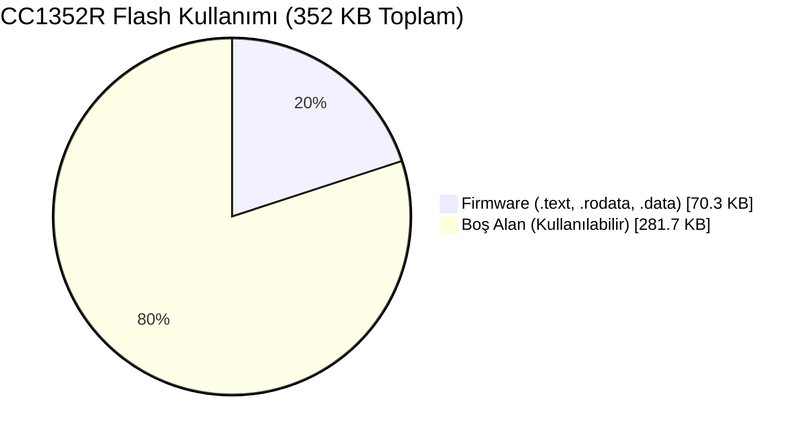
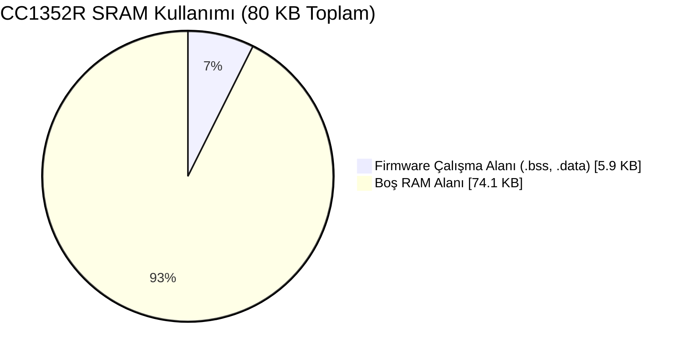

# ELF Analiz Raporu: `new-firmware.z1`

Bu rapor, Contiki-NG işletim sistemi kullanılarak derlenmiş olan `new-firmware.z1` donanım yazılımının (firmware), GNU Binutils (`msp430-gcc` araç zincirleri) kullanılarak yapısal analizini içermektedir.

---

## 1. Dosyanın ELF Sınıfı, Mimarisi ve Giriş Adresi

`readelf -h new-firmware.z1` aracı ile elde edilen ELF başlık (header) analizine göre:

- **ELF Sınıfı (Class):** `ELF32` (Dosya 32-bit bellek adreslemesi kullanılarak oluşturulmuştur.)
- **Mimari (Machine):** `Texas Instruments msp430 microcontroller` (Kod, MSP430 çekirdeğinde koşacak biçimde makine diline derlenmiştir.)
- **Giriş Adresi (Entry Point Address):** `0x3100` (Donanıma enerji verildiğinde veya resetlendiğinde, işletimin (C başlangıç rutinlerinin) koşmaya başlayacağı ilk bellek adresidir.)

## 2. Temel Bölümler (Sections) ve İfade Ettikleri Anlam

`readelf -S new-firmware.z1` komutu ile elde edilen bölüm tablosuna (Section Headers) göre temel kısımlar şunlardır:

*   **`.text` (Adres: 0x3100):** Yürütülebilir makine kodlarını (fonksiyonlar, komutlar) barındıran temel kısımdır. Giriş adresi (`0x3100`) tam olarak bu bölümün başlangıcına işaret eder.
*   **`.rodata` (Adres: 0xc870):** Read-only data (Salt okunur veri) bölümüdür. Sabit (const) tanımlanmış değişkenler, sabit dizeler (string literal) burada tutulur. Asla RAM'e kopyalanmaz, Flash'tan okunur.
*   **`.data` (Adres: 0x1100):** İlk değeri atanmış (initialized) global ve statik değişkenleri tutar. Bu bölüm ELF içerisinde yer kaplar ve mikrodenetleyici açıldığında Flash bellekten RAM'e kopyalanır.
*   **`.bss` (Adres: 0x1250):** İlk değeri atanmamış (veya sıfır atanmış) global ve statik değişkenlerin yerini belirtir. Bu bölüm dosya içerisinde (Flash'ta) yer kaplamaz, sadece "bu veriler RAM'de şu kadar yer kaplayacak ve başlangıçta sıfırla doldurulacak" bilgisini verir.
*   **`.vectors` (Adres: 0xffc0):** Mikrodenetleyicinin Kesme Vektör Tablosu'nu (Interrupt Vector Table) barındırır. Donanım seviyesinde gerçekleşen olaylarda (Zamanlayıcı, UART vb.) işlemcinin hangi adrese zıplayacağını tutan pointer'ları barındırır.

## 3. Kod ve Veri Boyutları

`size new-firmware.z1` komutu ile elde edilen çıktı:

| text | data | bss | dec | hex |
| :--- | :--- | :--- | :--- | :--- |
| 71715 | 336 | 5706 | 77757 | 12fbd |

**Anlamı:**
- **`text` (71715 Bayt):** Cihazın Flash belleğinde yer kaplayacak olan asıl program kodu (`.text`) ve salt okunur verilerin (`.rodata`) toplam boyutudur. Yaklaşık 70 KB yer kaplamaktadır.
- **`data` (336 Bayt):** Hem Flash bellekte (başlangıç değerini saklamak için) hem de RAM'de (çalışma esnasında tutulmak için) yer kaplayan veridir.
- **`bss` (5706 Bayt):** Sadece cihazın RAM'inde çalışma anında ayrılacak olan boş alandır.
- **Toplam RAM Kullanımı:** `data + bss` = 6042 Bayt (~5.9 KB).
- **Toplam Flash (ROM) Kullanımı:** `text + data` = 72051 Bayt (~70.3 KB).

## 4. Sembol Tablosu ve Anlamlı Semboller

`nm` ve `readelf -s` araçları ile incelenen sembol tablosu, yazılımdaki fonksiyonların ve değişkenlerin bellek adreslerindeki haritasıdır.

**Örnek Anlamlı Semboller:**
*   `0000313e T main` : C kodundaki ana `main()` fonksiyonumuzun bellekte `0x313e` adresinden itibaren başladığını gösterir.
*   `00000000 T __far_bss_start` : BSS bölümünün RAM'de nerede başlayacağını gösteren, linker tarafından atanan özel semboldür.
*   `00003376 t __br_unexpected_` : Cihaz beklenmeyen bir donanım kesmesiyle karşılaştığında programın güvenli bir şekilde hatayı yakalayabilmesi (veya çökmesi) için konulan varsayılan fonksiyondur.

## 5. Kesme Vektörleri ve Başlangıç Adresi İlişkisi

Mikrodenetleyiciler enerjilendiğinde doğrudan `.text` veya `main()` fonksiyonuna atlamazlar. Donanım, ROM'un en sonundaki sabit adreste (MSP430 için bu `0xFFFE`'dir ve `.vectors` bölümündedir) bulunan adresi okur ve o adrese atlar (Reset Vector).
`new-firmware.z1` dosyasının ELF başlığındaki "Entry point address: `0x3100`" verisi, mikrodenetleyicinin resetlendiği an C Runtime çevresini ayağa kaldırmak üzere sıçrayacağı ilk makine kodunun başlangıcıdır. `0x3100` adresinde işlemci register'ları ve RAM (`.data` ve `.bss`) C kodunun çalışmasına hazır hale getirilir, daha sonra `main()` fonksiyonu olan `0x313e` adresine dallanma gerçekleşir.

## 6. Dosya Neden "Ham Binary" Değil de "ELF Executable" Olarak Değerlendirilmektedir?

Eğer bu dosya bir "Ham Binary" (`.bin`) olsaydı, dosya içerisindeki her bir bayt, istisnasız olarak işlemcinin bellek veya flash uzayına doğrudan yazılması gereken makine kodları olurdu. Toplam diskte kapladığı alan kod alanına eşit olurdu. Ancak bizim dosyamız diskte 129 KB yer kaplamasına rağmen içindeki kod sadece ~72 KB'dir.

Bunun sebebi dosyanın bir **ELF (Executable and Linkable Format)** olmasıdır:
1.  **Metadata (Üst veri) İçerir:** Dosyanın başında hangi mimari için derlendiğini, giriş adresinin ne olduğunu gösteren bir "ELF Header" vardır.
2.  **Bellek Haritalaması Taşır:** İçerisindeki `Program Headers` ve `Section Headers` sayesinde, yükleyici (loader/bootloader) yazılıma hangi byte kümesinin bellekte `0x3100` adresine (kod), hangi kümenin `0x1100` adresine (veri) yükleneceğini söyler.
3.  **Debug ve Sembol Bilgisi:** İçerisinde kodların orijinal C satırlarına ait referanslar (`.debug_info`) ve fonksiyon isimleri (`.symtab`) barındırır. Bu bilgiler sayesinde mikrodenetleyicide adım adım (step-by-step) hata ayıklama yapılabilir. İşlemciye (örneğin CC1352R'ye) yüklenirken bu meta datalar belleğe gönderilmez, sadece gerekli makine kodları Flash'a ayıklanarak yazılır.

---

## 7. CC1352R SoC Bellek Mimarisine Uyarlama ve Görselleştirme

Analiz ettiğimiz bu firmware, ARM Cortex-M4F tabanlı Texas Instruments **CC1352R** çipine (Launchpad/Sensortag) derlenmiş olsaydı, elde ettiğimiz `size` çıktıları SoC'nin teknik dokümantasyonundaki donanım sınırlarına göre aşağıdaki gibi yerleşecekti:

**CC1352R Donanım Kapasiteleri:**
- **Main Flash:** 352 KB
- **SRAM:** 80 KB
- **ROM:** 256 KB
- **Cache / GPRAM:** 8 KB

**Firmware İhtiyacı:**
- **Flash İhtiyacı (`text` + `data`):** ~70.3 KB
- **SRAM İhtiyacı (`data` + `bss`):** ~5.9 KB

### CC1352R Disk ve Bellek Uzayı Görselleştirmesi

### Sonuç ve Yorum:
Bu boyutlara sahip `X firmware` dosyası CC1352R SoC içerisine atıldığında;
1. **Flash'ın yalnızca ~%20'sini** dolduracaktır. Geriye kalan yaklaşık 281 KB alan; yedek imajların (Çift imaj / Slot A - Slot B mimarisi ile OTA için) saklanması, bootloader'ın yerleşmesi veya ek dosya sistemleri (CFS vb.) oluşturmak için oldukça geniş bir alan sağlayacaktır.
2. **RAM'in yalnızca ~%7.3'ünü** kullanacaktır. Bu sayede cihazın ağ (network stack) tamponları, UDP iletişimindeki kayıp paketleri tutacak olan büyük sliding-window (kayan pencere) tamponları için devasa bir boş alan kalmaktadır. RAM kısıtı yaşanmayacaktır.
3. ELF dosyası diskte 129 KB yer tutsa da Flash'a yazılan net miktar ~70.3 KB olacağından OTA transferinde 4096 Baytlık örnek modelden çok daha fazla (yaklaşık 1100 adet 64-baytlık blok) paket aktarılması gerekecektir.

> [!NOTE]
> Bu oranlar, CC1352R donanımının OTA (Over The Air) mekanizması için ne kadar elverişli ve geniş bir bellek uzayına sahip olduğunu net bir şekilde kanıtlamaktadır.
